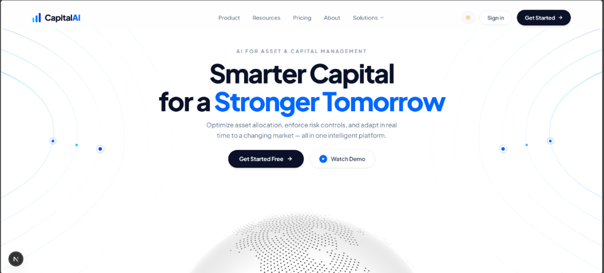
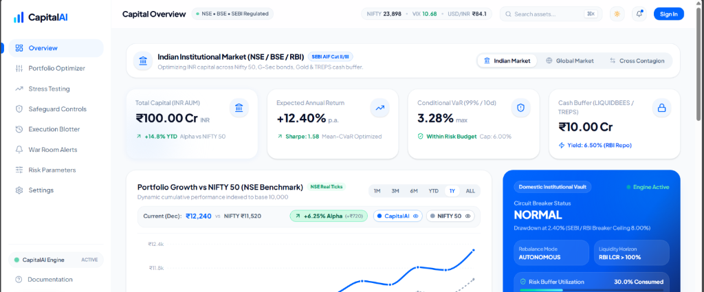

<p align="center">
  
</p>

<h1 align="center">CapitalAI</h1>

<p align="center">
  <b>Institutional Portfolio Optimizer & Autonomous Safeguard System</b><br/>
  <i>Advanced Quantitative Telemetry and Tail Risk Management</i>
</p>


<p align="center">
  
  <br/><br/>
  
</p>

---

## 📋 Table of Contents

1. [Executive Summary](#-executive-summary)
2. [Problem Statement](#-problem-statement)
3. [The CapitalAI Solution](#-the-capitalai-solution)
4. [System Architecture](#-system-architecture)
5. [Unique Value Proposition](#-unique-value-proposition)
6. [Software Directory Map](#-software-directory-map)
7. [Local Setup & Deployment Guide](#-local-setup--deployment-guide)
8. [Future Roadmap](#-future-roadmap)

---

## 🎯 Executive Summary

**CapitalAI** is a next-generation quantitative portfolio management and autonomous risk safeguard system designed for institutional asset managers. It integrates advanced mathematical optimization (Mean-CVaR, HRP), real-time global market telemetry, and automated multi-tier circuit breakers to dynamically protect capital against extreme tail events and volatility regime shifts.

---

## ⚠️ Problem Statement

Institutional asset managers face compounding challenges in dynamic market environments:

1. **Reactive Risk Management**: Traditional VaR (Value at Risk) fails to capture the true magnitude of tail-end losses (black swan events). By the time human analysts calculate drawdowns and convene a risk committee, catastrophic capital destruction has already occurred.
2. **Sub-optimal Asset Allocation**: Classical Markowitz Mean-Variance optimization suffers from extreme sensitivity to input estimates and often results in highly concentrated, ill-conditioned portfolios that require massive turnover to rebalance.
3. **Information Fragmentation**: Execution blotters, macro-economic telemetry, and crisis scenario simulations are isolated across disjointed Bloomberg terminal screens and Excel spreadsheets, slowing down CIO decision-making.

---

## 💡 The CapitalAI Solution

CapitalAI centralizes quantitative asset allocation and embeds autonomous safeguards directly into the execution workflow.

### 🌟 Core Capabilities

* **Advanced Mathematical Optimization**: Utilizes Rockafellar-Uryasev Mean-CVaR linear programming via CVXPY and Hierarchical Risk Parity (HRP) graph clustering to construct robust portfolios that inherently penalize fat-tailed skewness and minimize turnover friction.
* **Autonomous 3-Tier Circuit Breaker**: Continuously monitors real-time market data to detect risk breaches. It dynamically transitions through NORMAL, AMBER (warning), RED (auto-rebalance), and FROZEN (liquidity halt) states without human delay.
* **Regime-Conditioned Telemetry**: Employs 2-State Markov Switching (Hamilton 1989) to identify latent volatility shifts before traditional drawdowns occur, adjusting capital allocations proactively.
* **Live Global Telemetry**: Ingests real-time pricing, NSE/BSE feeds, RBI repo rates, US Treasury fiscal data, and Finnhub news wires to drive live analytics.

---

## 🏗️ System Architecture

### 1. Backend Architecture (FastAPI Quant Engine)

* **API Framework**: **FastAPI** providing high-performance ASGI REST endpoints.
* **Quant Engine**: **Python 3.12**, utilizing `CVXPY` (Clarabel/SCS solvers), `NumPy`, `SciPy`, and `Statsmodels`.
* **Live Data Ingestion**: `yfinance`, `Finnhub`, and official US Treasury APIs for live market pricing, macro sensors, and EDGAR SEC Filings.
* **Safeguard Engine**: In-memory Append-Only Cryptographic Audit Ledger logging every autonomous and manual intervention.

### 2. Frontend Architecture (Next.js Command Center)

* **Framework**: **Next.js 16 (App Router)** and React 19.
* **UI/UX**: Tailwind CSS v4, Lucide-React for iconography.
* **Data Visualization**: **Recharts** for interactive Efficient Frontiers and Drawdown curves; COBE 3D Interactive Globe for the landing hero.
* **Authentication**: **Clerk** Identity integration for Role-Based Access Control (RBAC).

---

## 💎 Unique Value Proposition

| Dimension | Traditional Portfolio Management | CapitalAI |
| :--- | :--- | :--- |
| **Risk Metric** | Variance / Standard Deviation. Ignores tail severity. | **CVaR (Expected Shortfall)**. Penalizes extreme black swan tail risks. |
| **Crisis Response** | Human-driven. Hours or days to convene risk committees. | **Autonomous Circuit Breaker**. Millisecond response to breaches. |
| **Liquidity Awareness** | Static assumptions based on market cap. | **FRTB Liquidity Horizons**. Dynamic scaling based on Basel MAR33.12 bands. |
| **Portfolio Stability** | Markowitz inverse covariance matrices (highly unstable). | **Hierarchical Risk Parity**. Machine learning graph clustering for stable allocations. |
| **Data Silos** | Disjointed terminals and spreadsheets. | **Unified War Room**. Optimizations, stress-tests, and blotters in one pane. |

---

## 📁 Software Directory Map

### Backend (`/backend`)

* ⚙️ **`engine/`**: The core quantitative brain containing `optimizer.py`, `regime.py`, `risk_metrics.py`, and `liquidity.py`.
* 🛡️ **`controls/`**: Contains the `circuit_breaker.py` logic and `audit_log.py` ledger.
* 🌐 **`routers/`**: FastAPI route definitions for `live_feed.py`, `optimize.py`, and `stress_test.py`.
* 🧪 **`tests/`**: 100% passing automated test suite validating all mathematical models.

### Frontend (`/frontend`)

* 📊 **`src/app/(dashboard)/dashboard/page.tsx`**: Capital Overview with $10M AUM telemetry and live gauges.
* 📈 **`src/app/(dashboard)/optimize/page.tsx`**: Portfolio Optimizer rendering the Efficient Frontier and target rebalancing weights.
* 💥 **`src/app/(dashboard)/stress-test/page.tsx`**: War Room crisis scenario stress simulator (e.g., 2008 Lehman, COVID Flash Crash).
* 📝 **`src/app/(dashboard)/dashboard/trades/page.tsx`**: Institutional Execution Blotter tracking slippage and venue routing.
* 🔐 **`src/app/(dashboard)/audit-log/page.tsx`**: Safeguard Controls & Immutable Audit Trail for CRO oversight.

---

## 🛠️ Local Setup & Deployment Guide

### Prerequisites

* Node.js (v18.x or later) & npm

* Python 3.12 & `uv` package manager

### 1. Start the Backend Quant Engine

```bash
cd backend
# Create and activate a virtual environment, then run:
uvicorn main:app --host 127.0.0.1 --port 8000
```

*The API will be live at `http://localhost:8000` with Swagger docs at `/docs`.*

### 2. Start the Frontend Command Center

```bash
cd frontend
npm install
# Initialize Clerk Authentication Keys
npx clerk@latest init -y
# Run the development server
npm run dev -- -p 3001
```

*The dashboard will be live at `http://localhost:3001`.*

### 3. Run Automated Tests

```bash
cd backend
pytest -v
```

*Validates all 30 tests covering optimization math, risk metrics, and circuit breaker logic.*

---

## 🛣️ Future Roadmap

1. **Live Brokerage Execution (Alpaca / Interactive Brokers)**: Transition from generating trade blotters to direct autonomous execution routing via API.
2. **Database Persistence (PostgreSQL)**: Implement SQLAlchemy to persistently store user portfolios, multi-tenant accounts, and historical audit ledgers.
3. **AI "Risk Copilot" (LLM Integration)**: Add an integrated ChatGPT-style side panel hooked into the live FastAPI telemetry to answer on-the-fly portfolio questions (e.g., *"Why did the circuit breaker trigger to AMBER?"*).
4. **Historical Backtesting Engine**: Build a robust engine to simulate and chart optimized weight performance over rolling 10-year historical windows.
5. **Factor Exposure Analysis**: Implement Fama-French 5-factor regression analysis to automatically decompose portfolio returns into specific market factors (Value, Size, Quality, Momentum).
