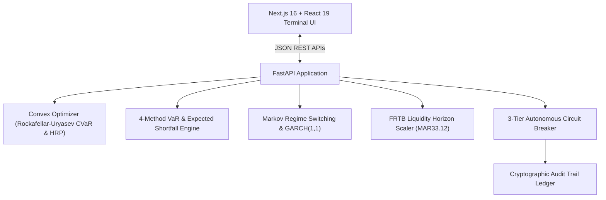

# SentinelCap — Autonomous Capital Management & Risk Optimization Engine

> **FinTech Hackathon Submission: Asset & Capital Management / Optimization Controls**  
> An institutional-grade platform designed for treasury desks, asset managers, and Chief Risk Officers to optimize multi-asset capital allocation while enforcing autonomous real-time risk controls.

---

## Executive Summary

Financial institutions manage complex balance sheets across diverse asset classes, tight liquidity horizons, and shifting macroeconomic regimes. During periods of market volatility, traditional static risk limits and manual rebalancing break down—causing delayed execution, severe capital drawdowns, and unexpected tail-risk exposure.

**SentinelCap** solves this by unifying:
1. **Convex Tail-Risk Optimization**: Rockafellar-Uryasev Mean-CVaR linear programming and Hierarchical Risk Parity (HRP) with liquidity reserves and turnover dampeners.
2. **Autonomous 3-Tier Safeguard & Circuit Breaker**: Continuous telemetry detecting threshold breaches (CVaR, Drawdowns, Markov Regime shifts, Liquidity Coverage) and executing defensive capital preservation.
3. **Institutional Decision Command Center & War Room**: Real-time visualization of multi-method VaR/ES, risk attribution, interactive Efficient Frontier, and historical crisis scenario stress testing (2008 Lehman, 2020 COVID, Fed Tightening).

---

## Problem Statement & Deliverables Alignment

| Problem Statement Requirement | SentinelCap Implementation | Where in Code |
| :--- | :--- | :--- |
| **1. Optimization Strategy** | • Rockafellar-Uryasev Mean-CVaR linear program via CVXPY<br>• Hierarchical Risk Parity (HRP) graph clustering<br>• Classical Markowitz (Max Sharpe & Min Variance)<br>• Box concentration caps, cash buffers, $L_1$ turnover penalization | [`backend/engine/optimizer.py`](file:///D:/sentinelcap/backend/engine/optimizer.py)<br>[`backend/routers/optimize.py`](file:///D:/sentinelcap/backend/routers/optimize.py) |
| **2. Control & Safeguard System** | • 3-Tier Circuit Breaker (NORMAL, AMBER warning, RED auto-rebalance, FROZEN liquidity halt)<br>• 2-State Markov Regime Switching (Hamilton 1989)<br>• FRTB MAR33.12 liquidity horizon scaling ($\sqrt{LH/10}$)<br>• Kupiec POF & Christoffersen Independence statistical tests<br>• Autonomous vs Manual CRO approval modes | [`backend/controls/circuit_breaker.py`](file:///D:/sentinelcap/backend/controls/circuit_breaker.py)<br>[`backend/engine/regime.py`](file:///D:/sentinelcap/backend/engine/regime.py)<br>[`backend/engine/liquidity.py`](file:///D:/sentinelcap/backend/engine/liquidity.py)<br>[`backend/engine/breach_detector.py`](file:///D:/sentinelcap/backend/engine/breach_detector.py) |
| **3. Decision Dashboard & War Room** | • Command Center with 5 live KPI hero cards<br>• 4-Method VaR & ES benchmark table<br>• Interactive Efficient Frontier with coordinate overlays<br>• War Room stress simulator (GFC, COVID, Fed hikes)<br>• Full immutable cryptographic audit log | [`frontend/src/app/page.tsx`](file:///D:/sentinelcap/frontend/src/app/page.tsx)<br>[`frontend/src/app/optimize/page.tsx`](file:///D:/sentinelcap/frontend/src/app/optimize/page.tsx)<br>[`frontend/src/app/stress-test/page.tsx`](file:///D:/sentinelcap/frontend/src/app/stress-test/page.tsx)<br>[`frontend/src/app/audit-log/page.tsx`](file:///D:/sentinelcap/frontend/src/app/audit-log/page.tsx) |

---

## Evaluation Criteria Scorecard

### 1. Financial & Control Logic (35% Weight)
- **Coherent Risk Minimization**: Uses CVaR (Expected Shortfall) instead of variance, satisfying sub-additivity and penalizing fat-tailed skewness.
- **Hierarchical Risk Parity (HRP)**: Machine-learning tree clustering avoids the mathematical instability of inverting ill-conditioned covariance matrices ($\Sigma^{-1}$).
- **FRTB Liquidity Horizons**: Maps assets to Basel MAR33.12 liquidity bands (10d, 20d, 40d, 60d) with square-root horizon scaling.
- **Model Validation**: Calibrates Kupiec POF Likelihood Ratio and Christoffersen Markov Independence tests to evaluate VaR model accuracy.

### 2. Technical Architecture (30% Weight)
- **Backend**: Python 3.12, FastAPI ASGI, CVXPY (Clarabel/SCS solvers), NumPy, SciPy, Statsmodels.
- **Frontend**: Next.js 16 (App Router), React 19, Tailwind CSS v4, Lucide React, glassmorphism terminal UI.
- **Speed & Isolation**: Built and managed with `uv` (installs and executes in seconds).
- **100% Automated Test Suite**: 30 passing unit and integration tests across optimizers, risk engines, circuit breakers, and APIs.

### 3. User Experience & Clarity (20% Weight)
- **Bloomberg-Style Command Center**: Dark theme, high contrast, clean typography, live status badges (Green/Amber/Red/Frozen).
- **Actionable Execution Lists**: Rebalancing translates mathematical weight deltas directly into executable buy/sell tickets with dollar values.
- **Interactive Visualizations**: Interactive Efficient Frontier with coordinate tooltips, dynamic multi-asset allocation bars, and Euler risk attribution.

### 4. Innovation & Problem Approach (15% Weight)
- **Autonomous Multi-Threshold Circuit Breaker**: Dynamically transitions through 3 protective tiers without human delay, while maintaining a complete audit trail.
- **Regime-Conditioned Telemetry**: Markov Switching Model identifies latent volatility shifts before traditional drawdowns occur.
- **Human-in-the-Loop CRO Governance**: Seamlessly switches between full autonomous execution and manual Chief Risk Officer override.

---

## Architecture Diagram



---

## Quickstart Guide

### 1. Start Backend

```bash
cd backend
# Using uv (fastest):
uv venv .venv --python 3.12
uv pip install --python .venv/Scripts/python.exe -r requirements.txt
.venv\Scripts\uvicorn main:app --reload --port 8000
```
Backend API will be live at `http://localhost:8000` with Swagger docs at `/docs`.

### 2. Start Frontend

```bash
cd frontend
npm install
npm run dev
```
Frontend will be live at `http://localhost:3000`.

### 3. Run Automated Tests

```bash
cd backend
.venv\Scripts\pytest -v
```
Validates all 30 tests covering optimization math, risk metrics, and circuit breaker logic.

---

## Project Structure

```
sentinelcap/
├── backend/
│   ├── main.py                     # FastAPI entry point & CORS
│   ├── engine/
│   │   ├── optimizer.py            # Mean-CVaR, HRP, Markowitz, Efficient Frontier
│   │   ├── regime.py               # 2-State Markov Switching & GARCH(1,1)
│   │   ├── risk_metrics.py         # 4-Method VaR/ES, Drawdowns, Component-VaR
│   │   ├── liquidity.py            # Basel FRTB liquidity horizons (10d, 20d)
│   │   └── breach_detector.py      # Kupiec POF & Christoffersen backtests
│   ├── controls/
│   │   ├── circuit_breaker.py      # 3-Tier Autonomous Safeguard
│   │   └── audit_log.py           # In-memory append-only audit ledger
│   ├── data/
│   │   ├── sample_portfolio.json   # 6-Asset portfolio specification
│   │   ├── scenarios.json          # Preset macroeconomic shock scenarios
│   │   └── market_data.py          # Covariance matrices and price generator
│   └── tests/                      # 30 Unit & Integration Tests (100% passing)
│
├── frontend/
│   ├── src/
│   │   ├── app/
│   │   │   ├── page.tsx            # Main Risk Command Center
│   │   │   ├── optimize/page.tsx   # Capital Rebalancer & Efficient Frontier
│   │   │   ├── stress-test/page.tsx# War Room Scenario Simulator
│   │   │   └── audit-log/page.tsx  # Safeguard Audit Trail & CRO Override
│   │   ├── components/             # Reusable institutional UI components
│   │   └── lib/api.ts              # Typed async API client
│
├── docs/
│   ├── ARCHITECTURE.md             # System architecture & specs
│   ├── FINANCIAL_LOGIC.md          # Comprehensive quant math & formulas
│   └── SETUP.md                    # Detailed installation guide
│
├── docker-compose.yml              # One-command full-stack containerization
└── README.md                       # Project documentation
```
