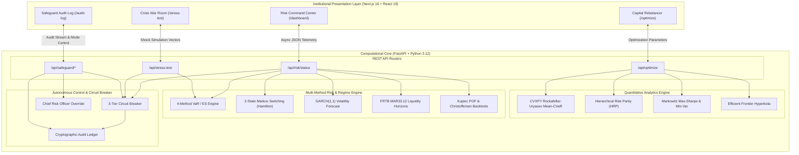

# SentinelCap — System Architecture & Technical Specifications

SentinelCap is an autonomous capital optimization and tail-risk control platform designed for financial institutions, treasury desks, and risk management committees.

---

## 1. High-Level System Architecture

---

## 2. Component Architecture Breakdown

### 2.1 Quantitative Optimization Layer (`backend/engine/optimizer.py`)
- **Mean-CVaR Optimizer**:
  Formulates Conditional Value-at-Risk as a linear program using Rockafellar & Uryasev's theorem with CVXPY and Clarabel/SCS solvers.
  Supports box constraints ($0 \le w_i \le w_{\max}$), liquidity buffers ($w_{\text{BIL}} \ge \text{cash\_min}$), and $L_1$ turnover penalization $\kappa \sum |w_i - w_0|$.
- **Hierarchical Risk Parity (HRP)**:
  Generates machine-learning tree clusters using correlation distance $d = \sqrt{(1-\rho)/2}$, quasi-diagonalizes the dendrogram, and recursively bisects allocations based on cluster variance. Avoids covariance matrix inversion instability.
- **Markowitz Mean-Variance**:
  Solves quadratic programming targets (Max Sharpe, Minimum Variance) via SciPy SLSQP.
- **Efficient Frontier Generator**:
  Generates 25 pareto-optimal portfolios spanning the risk-return curve and plots Current vs Target coordinates.

### 2.2 Risk Analytics & Regulatory Layer (`backend/engine/`)
- **4-Method VaR & Expected Shortfall** (`risk_metrics.py`):
  1. Historical Simulation (empirical quantile)
  2. Parametric Delta-Normal ($z_\alpha \sigma_p - \mu$)
  3. Cornish-Fisher Expansion (adjusting for skewness and excess kurtosis)
  4. Monte Carlo Simulation (10,000 correlated Cholesky paths)
- **Markov Regime Switching** (`regime.py`):
  Calibrates a 2-state latent Markov chain (Calm vs Crisis) over portfolio returns via `statsmodels` MarkovRegression. Produces smoothed marginal probabilities $P(\text{Crisis})$.
- **GARCH(1,1) Volatility Forecaster** (`regime.py`):
  Computes rolling conditional variance and generates a 5-day forward-looking volatility trajectory.
- **FRTB Liquidity Horizons** (`liquidity.py`):
  Assigns assets into Basel MAR33.12 liquidity bands (10d, 20d, 40d, 60d) and adjusts Expected Shortfall using square-root scaling $\sqrt{LH_j / 10}$.
- **Statistical Model Backtesting** (`breach_detector.py`):
  Runs Kupiec POF Likelihood Ratio test, Christoffersen Independence test, and determines Basel Committee Traffic Light zones (Green, Amber, Red).

### 2.3 Autonomous Safeguard & Governance (`backend/controls/`)
- **3-Tier Circuit Breaker** (`circuit_breaker.py`):
  - **Level 1 (AMBER)**: Triggered when $CVaR > 1.2 \times \text{Budget}$ or Regime = "Crisis". Broadcasts warning telemetry.
  - **Level 2 (RED)**: Triggered when $CVaR > 1.5 \times \text{Budget}$ or $\text{Drawdown} > 8.0\%$. Executes autonomous defensive rebalance to HRP weights with turnover dampening.
  - **Level 3 (FROZEN)**: Triggered when $\text{Drawdown} > 15.0\%$ or $\text{Liquidity} < 0.80$. Emergency trading halt; liquidates to 100% Cash/T-bills; requires manual CRO override.
- **Operational Mode Toggle**:
  Supports `auto` (autonomous execution) and `manual` (human-in-the-loop recommendation requiring approval).
- **Audit Logger** (`audit_log.py`):
  Immutable, timestamped ledger of all threshold evaluations, state changes, and intervention trade tickets.

---

## 3. Technology Stack

| Layer | Technology | Purpose |
| :--- | :--- | :--- |
| **Frontend Framework** | Next.js 16 (App Router) + React 19 | Server/Client rendering, dark-mode terminal UI |
| **Styling & Icons** | Tailwind CSS v4 + Lucide React | Institutional dark-mode theme, glassmorphism |
| **Visualization** | Interactive SVGs & Recharts | Efficient frontier, asset allocation, VaR matrices |
| **Backend Framework** | FastAPI (ASGI) + Uvicorn | High-throughput asynchronous REST API |
| **Convex Optimization** | CVXPY + Clarabel / SCS | Linear programming formulation of Rockafellar-Uryasev CVaR |
| **Numerical & Statistics** | NumPy, Pandas, SciPy, Statsmodels | Matrix algebra, Cholesky simulation, Markov regression |
| **Package Management** | `uv` (Python 3.12) & `npm` (Node v24) | High-speed dependency installation and isolated venvs |
| **Testing** | Pytest, Pytest-Asyncio, HTTPX | 100% automated test coverage of quant and control logic |
